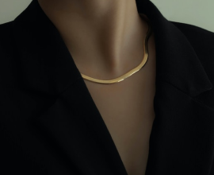
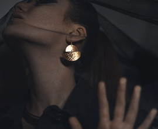
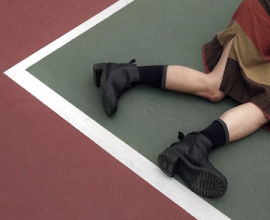

# RenaudRoyBeaudoin.github.io
<!DOCTYPE html>
<html lang="en">
<head>
    <meta charset="UTF-8">
    <title>Title</title>
    <link rel="preconnect" href="https://fonts.googleapis.com">
    <link rel="preconnect" href="https://fonts.gstatic.com" crossorigin>
    <link href="https://fonts.googleapis.com/css2?family=Lato:ital,wght@0,300;0,400;0,700;0,900;1,300;1,400;1,700;1,900&family=Ovo&family=Quicksand:wght@300;400;500;600;700&display=swap" rel="stylesheet">
    <link rel="stylesheet" href="CSS/normalize.css">
    <link rel="stylesheet" href="CSS/style.css">
</head>

<body>
    <header>
        

            

                
                <nav>
                    <ul>
                        <li><a href="#accueil">Accueil</a></li>
                        <li><a href="#produits">Produits</a></li>
                        <li><a href="#galerie">Galerie</a></li>
                        <li><a href="#ressources">Ressources</a></li>
                    </ul>
                </nav>
                <a href="https://www.youtube.com/watch?v=AoXdRMoh6HE&ab_channel=SteveGravel" target="_blank">
Agir
</a>
            

        

        

            

                
                <h3>Une compagnie Humaine qui propose des solutions Humaines à vos problèmes d’Humains... avec un vent de nouveauté</h3>
                <a href="https://www.youtube.com/watch?v=AoXdRMoh6HE&ab_channel=SteveGravel" target="_blank">
agir
</a>
            

        

    </header>

    <main>
        

            

                <h2>Nos produits, vos demandes</h2>
                <h4>Choubidoua, personne ne regardera ça, tant que je fais des rimes en a, ça passssera !</h4>
            

            

                <article>
                    
                    

                        <h4>01</h4>
                        <a href="https://www.idrole.ca/" target="_blank"><h4>CHANDAIL</h4></a>
                        
"Entre toi et moi il y a un produit qui s'appelle un produit, et c'est un produit qui s'appelle le chandail, alors si tu fais ça (porter/retirer) comme ça, tu vis, mais si je tue le chandail comme sur la lune, tu meurs !"

                    

                </article>

                <article>
                    

                        <h4>02</h4>
                        <a href="https://www.idrole.ca/" target="_blank"><h4>ÉPAULETTE</h4></a>
                        
L'épaulette c'est quelque chose de concret mais pas concret. Parce que l'épaulette... peut me nourrir, mais aussi l'épaulette... peut me porter. Parce que l'épaulette... a des lois magiques. l'épaulette peut tenir des cargos dans la mer, des milliers de tonnes d'acier... C'est quelque chose qui a beaucoup de dimensions l'épaulette.

                    

                    
                </article>

                <article>
                    
                    

                        <h4>03</h4>
                        <a href="https://www.idrole.ca/" target="_blank"><h4>VESTON</h4></a>
                        
"J'adore les vestons. Tu bois une bière et tu en as marre du goût. Alors tu portes des vestons. Les vestons, c'est doux et salé, fort et tendre, comme une femme. Porter des vestons, "it's a really strong feeling". Et après tu as de nouveau envie de boire de la bière. Les vestons c'est le mouvement perpétuel à la portée de l'homme."

                    

                </article>
            

        

    </main>

    <section class="Fashion" id="galerie">
        

            

                <h3>Notre toute nouvelle collection High Fashion</h3>
                <h4>Marchez sans peur du ridicule avec notre collection High Fashion</h4>
            

            

                <article>
                    
                    

                        <h4>Chaise</h4>
                        <a href="https://www.idrole.ca/" target="_blank">En savoir plus ›</a>
                    

                </article>

                <article>
                    
                    

                        <h4>Col</h4>
                        <a href="https://www.idrole.ca/" target="_blank">En savoir plus ›</a>
                    

                </article>

                <article>
                    
                    

                        <h4>Collier</h4>
                        <a href="https://www.idrole.ca/" target="_blank">En savoir plus ›</a>
                    

                </article>

                <article>
                    
                    

                        <h4>Bonnet</h4>
                        <a href="https://www.idrole.ca/" target="_blank">En savoir plus ›</a>
                    

                </article>
            

        

    </section>

    <section class="Saison">
        

            

                <h3>Collection saisonnière</h3>
                <h4>Montrez vos couleurs avec la collection d’accesoire Of The Dead</h4>
            

            

                <article>
                    
                    

                        <h4>Chandail trop grand</h4>
                        <a href="https://www.idrole.ca/" target="_blank">En savoir plus ›</a>
                    

                </article>

                <article>
                    
                    

                        <h4>Voile agaçant</h4>
                        <a href="https://www.idrole.ca/" target="_blank">En savoir plus ›</a>
                    

                </article>

                <article>
                    
                    

                        <h4>Fausse barbe</h4>
                        <a href="https://www.idrole.ca/" target="_blank">En savoir plus ›</a>
                    

                </article>

                <article>
                    
                    

                        <h4>Il est tombé</h4>
                        <a href="https://www.idrole.ca/" target="_blank">En savoir plus ›</a>
                    

                </article>
            

        

    </section>

    <footer>
        

            <nav class="menuFooter" id="ressources">
                <ul>
                    <li><a href="#accueil">Accueil</a></li>
                    <li><a href="#produits">Produit</a></li>
                    <li><a href="#ressources">Nous joindre</a></li>
                </ul>
                
                <ul>
                    <li><a href="https://www.w3schools.com/css/css_link.asp" target="_blank">CSS gratuit</a></li>
                    <li><a href="http://www.linternaute.com/humour/dossier/07/vandamme/3.shtml" target="_blank">Van-Damn</a></li>
                    <li><a href="https://www.google.com/search?q=panier&rlz=1C1CHBF_frCA1026CA1026&sxsrf=ALiCzsa0yvUJRTrFiZkibjyx6drbhOM5Ig:1671483582564&source=lnms&tbm=shop&sa=X&ved=2ahUKEwiM277JyYb8AhWyV98KHSWpCKwQ_AUoAXoECAEQAw&biw=1536&bih=722&dpr=1.25" target="_blank">Panier</a></li>
                </ul>
            </nav>
            

                
                
                
                
                
                
            

            
© 2019 — 2020 Vie privé — Nétiquette

        

    </footer>
</body>
</html>